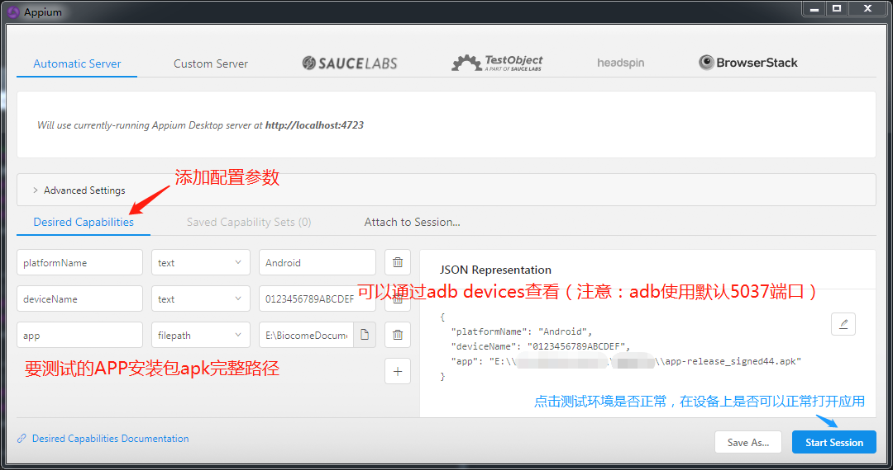

## JDK

```
JAVA_HOME -> D:\Program Files\Java\jdk1.8.0_131
CLASSPATH -> .;%JAVA_HOME%\lib\dt.jar;%JAVA_HOME%\lib\tools.jar;
Path -> %JAVA_HOME%\bin;%JAVA_HOME%\jre\bin;
```

## Android-sdk

```
ANDROID_ADB_SERVER_PORT -> 56789
ANDROID_HOME -> D:\AndroidSoftware\android-sdk
Path -> %ANDROID_HOME%\tools;%ANDROID_HOME%\platform-tools;
```

## Appium

[http://appium.io/](http://appium.io/)

> npm install -g appium

## [**python-client**](https://github.com/appium/python-client)

> pip install Appium-Python-Client

## Test

### 打开Appium service，点击右上角的“Start Inspector Session”



Package

```
pip install ConfigParser
pip install xlrd
pip install xlutils
```

yaml:[https://github.com/yaml/pyyaml](https://github.com/yaml/pyyaml)

### HTML测试报告模板

Python2  将HTMLTestRunner.py放到C:\Python3\Lib目录中

[http://tungwaiyip.info/software/HTMLTestRunner.html](http://tungwaiyip.info/software/HTMLTestRunner.html)

Python3

[https://pypi.org/project/HTMLReport/\#description](https://pypi.org/project/HTMLReport/#description)

