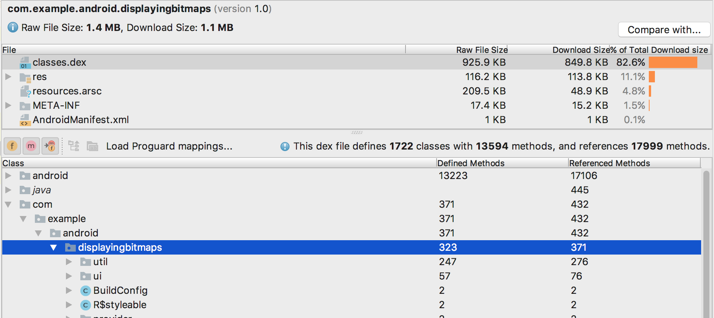
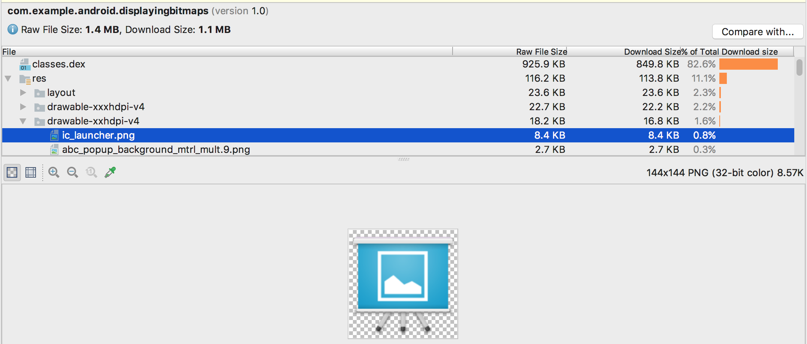

# 使用 APK Analyzer 分析您的 APK

Android Studio 包含 APK 分析器，可让您在构建流程完成后立即了解 APK 的组成。使用 APK 分析器可以减少调试应用的 DEX 文件和资源相关问题所用的时间，并且有助于减小 APK 的大小。您也可以使用 `apkanalyzer` 从命令行运行该工具。

通过 APK 分析器，您可以完成以下操作：

* 查看 APK 中的文件（如 DEX 和 Android 资源文件）的绝对大小和相对大小。
* 了解 DEX 文件的组成。
* 快速查看 APK 中的文件（如 `AndroidManifest.xml` 文件）的最终版本。
* 对两个 APK 进行并排比较。

当某个项目处于打开状态时，您可以通过以下三种方式访问 APK 分析器：

* 将 APK 拖动到 Android Studio 的 `Editor` 窗口中。
* 在 `Project` 窗口中切换到 `Project` 透视图，然后在默认的 `build/output/apks/` 目录中双击相应 APK。
* 在菜单栏中依次选择 `Build > Analyze APK`，然后选择您的 APK。

## 查看文件和大小信息

APK 是遵循 ZIP 文件格式的文件。APK 分析器将每个文件或文件夹显示为一个实体，这些实体具有可用于导航到文件夹中的展开功能。这些实体的层次结构反映了 APK 中的文件和文件夹的结构。

APK 分析器会显示每个实体的原始文件大小和下载文件大小值，如图 1 所示。`Raw File Size` 表示实体在磁盘上未经压缩时的大小，而 `Download Size` 则表示实体由 Google Play 提供时的压缩后大小的估计值。`% of Total Download Size `表示实体占 APK 总下载大小的百分比。

图 1. APK 分析器中的文件大小

## 查看 AndroidManifest.xml

如果您的项目包含多个 `AndroidManifest.xml` 文件（如产品变种的清单文件）或者包含的库也提供清单文件，这些文件会在您的 APK 中合并成一个文件。此清单文件在 APK 中通常是二进制文件，但在 APK 分析器中选择此文件后，系统会重构并呈现此实体的 XML 格式。在此查看器中，您可以了解在构建期间可能对您的应用所做的任何更改。例如，您可以看到应用所依赖的某个库中的 `AndroidManifest.xml` 文件是如何合并到最终 `AndroidManifest.xml` 文件中的。

此外，此查看器还提供了一些 lint 功能，并且会在右上角显示相关警告或错误。图 2 显示了查看器正在报告选定清单文件中的一条错误。

图 2. 选定清单文件的右侧空白处显示了一个错误图标

## 查看 DEX 文件

在 APK 分析器的 DEX 文件查看器中，您可以立即查看应用的 DEX 文件中的底层信息。该查看器中提供了类、软件包、总引用和声明计数，这有助于决定是否使用 MultiDex 或如何移除依赖项以避免超出 `64K DEX` 限制。

图 3 描绘了一个低于 64k DEX 限制的中等大小的应用。`Defined Methods` 和 `Referenced Methods` 列中列出了 DEX 文件中每个软件包、类和方法的相关计数。`Referenced Methods` 列会统计 DEX 文件引用的所有方法。这通常包括在您的代码和依赖项库中定义的方法，以及在代码使用的标准 Java 和 Android 软件包中定义的方法 - 这些方法计入每个 DEX 文件中的 64k 方法限制。`Defined Methods` 列仅统计在某一个 DEX 文件中定义的方法，所以此数字是 `Referenced Methods` 的子集。请注意，如果将某个依赖项打包在 APK 中，这两个方法计数都会加上在该依赖项中定义的方法。另请注意，缩减大小和代码缩减功能也会在源代码经过编译后显著改变 DEX 文件的内容。

图 3. 一个中等大小的应用

## 过滤 DEX 文件树状视图

在 `Class` 列表正上方，APK 分析器提供了用于查看选定 DEX 文件内容的过滤器。

图 4. DEX 过滤器设置为显示 BuildConfig 的字段和方法

如需使用过滤器来显示某个类中的所有方法和字段，请执行以下操作：

1. 在 `File` 列表中，选择 `classes.dex` 文件。
2. 在 `Class` 列表中，导航到一个类并选择该类。
3. 展开您选择的类。
4. 切换 `Show fields` 图标  以显示或隐藏类字段。
5. 切换 `Show methods` 图标  以显示或隐藏类方法。
6. 切换 `Show all referenced methods or fields` 图标  以显示或隐藏引用的软件包、类、方法和字段。在树状视图中，斜体节点是在选定 DEX 文件中没有定义的引用。

DEX 文件可以引用在其他文件中定义的方法和字段。例如，`System.out.println()` 是对 Android 框架中的 `println()` 方法的引用。

## 加载 ProGuard 映射

过滤器图标旁边是 ProGuard 映射图标。它们处于灰显状态，直到您加载一组 ProGuard 映射文件来向 DEX 查看器添加一些功能，如对名称进行去混淆处理 (mapping.txt)、显示已移除的节点 (usage.txt)，以及指示无法移除的节点 (seeds.txt)。您导入的 ProGuard 映射文件的构建版本必须与启用了代码缩减功能后生成的 APK 的构建版本相同。

图 5. 加载 ProGuard 映射

要加载 ProGuard 映射文件，请执行以下操作：

1. 点击 `Load Proguard Mappings`。
2. 导航到包含映射文件的项目文件夹，然后加载所有文件、文件的任意组合或包含文件的文件夹。

映射文件通常位于 `project/app/build/outputs/mappings/release/`。如果文件选择器检测到此项目结构，会默认选择 **release** 文件夹。首先，文件选择器会检查与 `mapping.txt`、`seeds.txt` 和 `usage.txt` 完全匹配的文件名。接下来，文件选择器会检查在任意位置包含文本 `mapping`、`usage` 或 `seeds` 且以 `.txt` 结尾的文件名。例如，`release-seeds-1.10.15.txt` 就是一个匹配项。

以下列表介绍了映射文件：

1. `seeds.txt`：ProGuard 配置阻止在缩减过程中移除的节点以粗体显示。
2. `mapping.txt`：启用 **Deobfuscate names** ，以便恢复由 R8 进行了混淆处理的节点的原始名称。例如，可以将 a、b、c 之类进行了混淆处理的节点名称恢复为 MyClass、MainActivity 和 myMethod()。
3. `usage.txt`：启用 **Show removed nodes** ，以便显示 R8 在缩减过程中移除的类、方法和字段。恢复的节点带删除线。

## 显示字节码、Find usages 以及生成 Keep 规则

`Class` 列表视图中的节点具有一个上下文菜单，其中包含以下选项，可用于查看字节码、查找用法以及显示一个对话框（其中显示了您可以为选定节点复制并粘贴的 ProGuard 规则）。右键点击 `Class` 列表视图中的任意节点即可显示其上下文菜单。

`Show bytecode`：对选定的类、方法或字段进行反编译，并在对话框中显示 smali 字节码（而不是 Java 代码）表示形式，如下所示：

图 6. `init` 方法的 DEX 字节码

`Find usages`：显示 DEX 代码的哪些其他部分对选定的类或方法进行了引用（图 7）。如果加载了 `seeds.txt`，以粗体显示的节点表示 `Proguard` 配置阻止在缩减过程中移除这些节点：

图 7. 对 `MyClass` 的引用

`Generate Proguard Keep rule`：显示您可以复制并粘贴到项目 Proguard 配置文件中的 Proguard 规则，这些规则可阻止在代码缩减阶段移除给定的软件包、类、方法或字段（图 8）。如需了解详情，请参阅自定义要保留的代码。

图 8. 您可以从对话框复制到 Proguard 配置文件中的 Proguard 规则

## 查看代码和资源实体

各种构建任务会更改 APK 文件中的最终实体。例如，Proguard 缩减规则可以改变您的最终代码，而图片资源可以由`产品变种`中的资源替换。使用 APK 分析器可以轻松查看文件的最终版本：只需点击相应实体，下方便会显示文本或图片实体的预览，如图 9 所示。

图 9. 最终图片资源的预览

APK 分析器还可以显示各种文本和二进制文件。例如，在 `resources.arsc` 实体查看器中，您可以查看配置专用的值，如字符串资源的语言翻译。在图 10 中，您可以看到每个字符串资源的翻译。

图 10. 已翻译字符串资源的预览

## 比较 APK 文件

APK 分析器可以比较两个不同 APK 文件中的实体大小。当您需要了解为什么您的应用较之先前版本有所增大时，这非常有用。在发布经过更新的 APK 之前，请执行以下操作：

1. 将要发布的 APK 版本加载到 APK 分析器中。
2. 点击 APK 分析器右上角的 `Compare With`。
3. 在选择对话框中，找到上次向用户发布的 APK，然后点击 OK。

此时将显示一个类似于图 11 中的对话框，帮助您评估更新可能会对用户产生的影响。

图 11 显示了特定应用的调试 build 和发布 build 之间的差异。这两种构建类型使用不同的构建选项，因而会以不同的方式改变底层实体。

图 11. 调试版本 APK 和发布版本 APK 之间的差异

## 参考文献

[https://developer.android.google.cn/studio/build/apk-analyzer](https://developer.android.google.cn/studio/build/apk-analyzer)
