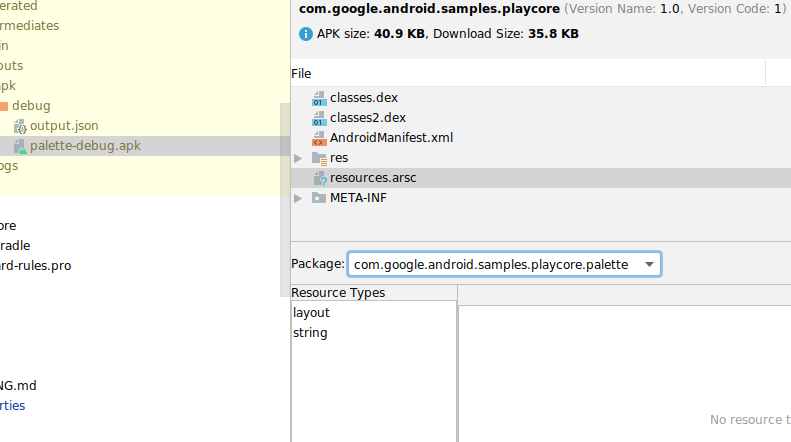

# Play Feature Delivery 概览
Google Play 的应用服务模型使用 Android App Bundle 针对每位用户的设备配置生成并提供经过优化的 APK，因此用户只需下载其运行您的应用所需的代码和资源。

Play Feature Delivery 使用了 app bundle 的多种高级功能，让您可按条件分发或按需下载应用的某些功能。

## 使用功能模块实现自定义分发
功能模块的独特优势在于，能够自定义如何以及何时将应用的不同功能下载到搭载 Android 5.0（API 级别 21）或更高版本的设备上。例如，为了减小应用的初始下载大小，您可以将某些功能配置为按需下载，或者只能由支持特定功能（比如拍照或增强现实）的设备下载。

虽然将应用作为 app bundle 上传时，默认即可获得高度优化的下载文件，但如需使用更高级且可自定义的 Feature Delivery 选项，您就必须使用功能模块对应用的功能进行额外的配置和模块化处理。也就是说，功能模块提供了用于创建模块化功能的基块，而您可以将各项功能配置为按需下载。

假设我们有一款让用户可在网络购物平台上买卖商品的应用。您可以合理地将该应用的以下各项功能模块化处理为单独的功能模块：

* 帐号登录与创建
* 浏览在线购物平台
* 上架商品
* 处理付款

下表列出了功能模块支持的不同分发选项，以及如何使用这些选项优化示例购物平台应用的初始下载大小。

分发选项	|行为	|示例用例	|开始使用
---|---|---|---
安装时分发	| 默认情况下，未配置上述任何分发选项的功能模块会在安装应用时下载。这是一种重要的行为，因为这意味着，您可以逐步采用高级分发选项。例如，只有在使用 Google Play 核心库完全实现按需下载机制之后，您才能受益于应用功能的模块化，并启用按需提供功能的选项。<br/><br/>此外，您的应用可以在之后请求卸载功能。因此，如果您在安装应用时需要某些功能，但之后又不需要了，您可以请求从设备上移除相关功能来减小安装大小。 |如果应用包含特定的指导 Activity（比如关于如何在购物平台上买卖商品的交互式指南），可以配置为在应用安装时默认包含该功能。<br/><br/>但是，为了减小应用的安装大小，应用可在用户完成该指导后请求删除该功能。|使用未配置高级分发选项的功能模块对应用进行模块化处理。<br/><br/>如需了解如何通过移除用户可能不再需要的功能模块减小应用的安装大小，请参阅管理已安装的模块。
按需分发	|允许您的应用根据需要请求和下载功能模块。	|如果在使用购物平台应用的用户中，只有 20% 的人发布待售商品，有一个不错的策略可以减小大多数用户的初始下载大小，那就是将拍照、输入商品描述及上架商品的功能配置为按需下载。也就是说，您可以为应用的销售功能配置功能模块，使该功能仅在用户表现出有兴趣上架商品以在购物平台上待售时才下载。<br/><br/>此外，如果用户在一段时间后不再出售商品，应用可以通过请求卸载该功能来减小其安装大小。|创建功能模块并配置按需分发。然后，应用就可以使用 Play Core 库请求按需下载该模块。
根据条件分发	|允许您指定特定的用户设备需求（例如硬件特性、区域设置和最低 API 级别），以确定是否在安装应用时下载模块化功能。	|如果购物平台应用的用户遍布全球，您可能需要支持仅在特定地区或区域常用的付款方式。为了减小应用的初始下载大小，您可以创建单独的功能模块处理特定类型的支付方式，并将这些模块根据用户的注册区域视条件安装在用户设备上。	|创建功能模块并配置按条件分发。
免安装分发	|Google Play 免安装体验让用户无需在设备上安装 APK 即可与应用互动。用户可以通过 Google Play 商店中的“立即体验”按钮或您创建的网址体验您的应用。这种内容提供形式可让您更轻松地提高应用的使用率。<br/><br/>借助免安装分发，您可利用 Google Play 免安装体验，让用户无需安装就能够立即体验应用的特定功能。|假设有一款游戏，游戏的前几个关卡包含在一个轻量级功能模块中。您可以启用该模块的免安装体验，这样用户就可以通过网址或“立即体验”按钮免安装体验游戏，而无需安装应用。	|创建功能模块并配置免安装分发。然后，应用就可以使用 Play Core 库请求按需下载该模块。<br/><br/>请注意，使用功能模块对应用功能进行模块化处理只是第一步。为了支持 Google Play 免安装体验，应用的基本模块和支持免安装体验的给定功能的下载大小必须满足严格的大小限制。如需了解详情，请参阅通过缩减应用或游戏大小支持免安装体验。

## 对应用进行模块化处理

对应用进行模块化处理就是将应用项目的逻辑组件拆分成独立模块的过程。

如需将应用功能妥善地重新组织到不同的独立组件中，您需要花时间仔细构思。不过，模块化能给您的项目带来以下好处：

* **并行开发**：通过将应用的逻辑组件拆分成不同的模块，组织中的不同团队或个人可以认领并负责不同的模块，从而减少合并冲突以及对其他团队的干扰。此外，如果有应用的各个部分共用的逻辑，可以使用库模块来促进代码重用和封装。
* **缩短构建时间**：构建系统（例如使用 Gradle 的 Android Studio 构建系统）针对划分成模块的项目进行了优化。例如，如果您在配备多核处理器的工作站上启用 Gradle 的并行项目执行优化，构建系统就能够并行地构建多个模块，从而显著缩短构建时间。项目的模块化程度越高，构建性能的改进就越明显。
* **自定义 Feature Delivery**：将应用的功能模块化处理为功能模块，是利用 Play Feature Delivery 的自定义分发选项（如按需分发、按条件分发和免安装分发）的前提条件。创建按需功能所需的工作量更大，并可能需要重构应用。因此，请仔细考虑“模块化处理为功能模块”和“从自定义分发选项中获益”这两者对应用的哪些功能益处最大。

如需按应用功能恰当地对项目进行模块化处理，您需要花费一定的时间认真考虑。当您决定开始对应用进行模块化处理时，首先应该为基本模块配置支持模块化功能所必需的属性。然后，您可以将功能模块配置为安装时分发，从而逐步对应用功能进行模块化处理，而不更改应用的当前行为。

## 功能模块清单
当使用 Android Studio 创建新功能模块时，该 IDE 会纳入模块作为功能模块正常运行所需的大多数清单属性。此外，有些属性是在编译时由构建系统注入的，因此您不需要自己指定或修改它们。下表列出了对功能模块非常重要的清单属性。

属性	|说明
---|---
<manifest<br/>...	|这是您的典型 <manifest> 块。
xmlns:dist="http://schemas.android.com/apk/distribution"	|指定一个新的 dist: XML 命名空间，如下所述。
split="split_name"	|当 Android Studio 构建 app bundle 时，会包含该属性。因此，**您不应自行添加或修改此属性**。<br/><br/>定义模块的名称，当应用使用 Google Play 核心库发出按需模块请求时会指定该名称。<br/><br/>**Gradle 如何确定该属性的值**：<br/><br/>默认情况下，当您使用 Android Studio 创建功能模块时，IDE 会使用您指定的模块名称，在 Gradle 设置文件中将该模块标识为 Gradle 子项目。<br/><br/>当您构建 app bundle 时，Gradle 会使用子项目路径的最后一个元素将此清单属性注入模块的清单。例如，如果您在 MyAppProject/features/ 目录中创建了一个新功能模块，并指定了“dynamic_feature1”作为其模块名称，IDE 会在 settings.gradle 文件中添加 ':features:dynamic_feature1' 作为子项目。构建 app bundle 时，Gradle 会将 <manifest split="dynamic_feature1"> 注入模块的清单。
android:isFeatureSplit="true / false">	|当 Android Studio 构建 app bundle 时，会包含该属性。因此，**您不应手动添加或修改此属性**。<br/><br/>指定此模块为功能模块。基本模块和配置 APK 中的清单要么省略此属性，要么将其设置为 false。
<dist:module	|这一新的 XML 元素定义了一些属性，这些属性可确定如何打包模块并作为 APK 分发。
dist:instant="true / false"	|指定是否应通过 Google Play 免安装体验为模块启用免安装体验。<br/><br/>如果应用包含一个或多个启用免安装体验的功能模块，您也必须为基本模块启用免安装体验。如果您使用的是 Android Studio 3.5 或更高版本，当您创建支持免安装体验的功能模块时，IDE 会为您完成此操作。<br/><br/>在设置 <dist:on-demand/> 时，不能将此 XML 元素设置为 true。不过，您仍可使用 Play Core 库请求以免安装体验的形式按需下载支持免安装体验的功能模块。当用户下载并安装您的应用时，设备会默认下载并安装应用的支持免安装体验的功能模块以及基本 APK。
dist:title="@string/feature_name"	|为模块指定一个面向用户的名称。例如，当设备请求确认下载时，便可能会显示该名称。<br/><br/>您需要将此名称的字符串资源包含在基本模块的 module_root/src/source_set/res/values/strings.xml 文件中。
<dist:fusing dist:include="true / false" /><br/></dist:module>	|指定是否在面向搭载 Android 4.4（API 级别 20）及更低版本的设备的 multi-APK 中包含此模块。<br/><br/>此外，当您使用 bundletool 从 app bundle 生成 APK 时，只有将此属性设置为 true 的功能模块才会包含在通用 APK 中。通用 APK 是一个单体式 APK，其中包含了应用所支持的所有设备配置的代码和资源。
\<dist:delivery>	|封装自定义模块分发的选项，如下所示。请注意，每个功能模块必须只配置这些自定义分发选项的一种类型。
\<dist:install-time>	|指定模块应在安装时可用。对于未指定自定义分发选项的其他类型的功能模块，这是默认行为。<br/><br/>如需详细了解安装时下载，请参阅配置安装时分发。<br/><br/>此节点还可以指定条件，用于限定要下载模块的设备所需满足的某些要求，例如设备功能，用户所在国家/地区或最低 API 级别。如需了解详情，请参阅配置按条件分发。
<dist:removable dist:value="true / false" />	|当未设置或设置为 false 时，bundletool 会在根据 bundle 生成拆分 APK 时将安装时模块整合到基本模块中。 由于整合会使拆分 APK 的数量减少，因此此设置可以提升应用的性能。<br/><br/>当 removable 设置为 true 时：安装时模块将不会整合到基本模块中。如果您想要在将来卸载这些模块，请将其设置为 true。 不过，配置过多可移除的模块可能会导致应用的安装时间增加。<br/><br/>默认为 false。只有当您想要针对某个功能模块停用融合功能时，才需要在清单中设置此值。<br/><br/>注意：只有在使用 Android Gradle 插件 4.2 或从命令行使用 bundletool v1.0 时，才能使用此功能。
\</dist:install-time>	 |
\<dist:on-demand/>	|指定应以按需下载的形式分发模块。也就是说，模块在安装时不会下载，但应用可以稍后请求下载。<br/><br/>如需详细了解按需下载，请参阅配置按需分发。
\</dist:delivery>	|
<application<br/>android:hasCode="true / false"><br/>...<br/>\</application>	|如果功能模块没有生成 DEX 文件（也就是说，它不包含之后编译成 DEX 文件格式的代码），您必须执行以下操作（否则，您可能会遇到运行时错误）：<br/>1. 在功能模块的清单中将 android:hasCode 设置为 "false"。<br/>2. 将以下内容添加到基本模块的清单中：<br/><br/><application<br/>&emsp;&emsp;  android:hasCode="true"<br/>&emsp;&emsp;  tools:replace="android:hasCode"><br/>&emsp;&emsp;  ...<br/>\</application>

> **注意**：在将 android:exported 设置为 true 的情况下，功能模块不得在其清单中指定 Activity。这是因为，当其他应用尝试启动相应 Activity 时，无法保证设备已下载相应的功能模块。此外，应用在尝试访问功能的代码和资源之前，应该先确认该功能已下载。如需了解详情，请参阅管理已安装的模块。

## 测试 Play Feature Delivery
测试 Play Feature Delivery 的最佳方法是通过 Google Play 商店进行测试。这是因为，Play Feature Delivery 的许多优势都依赖于将经过优化的 APK 的生成、签名和提供任务交由 Play 商店来完成。因此，无论您是直接上传 app bundle 还是配置更高级的分发选项，都应使用以下方法测试应用。

* **通过网址分享应用**。通过这种方式，您能够以最快的速度上传 app bundle 并通过 Google Play 商店中的链接将应用分享给受信任的测试人员。此外，这也是测试自定义提供选项（如按需下载功能）的最快方法。
* **设置开放式、封闭式或内部测试**。该方法提供结构化的测试通道，可以在面向外部用户发布应用之前，充分地测试应用的最终发布版本。

## 为资源构建 URI
如果您要使用 URI 访问存储在功能模块中的资源，请使用 Uri.Builder() 生成功能模块资源 URI，如下所示：


```java
String uri = Uri.Builder()
                .scheme(ContentResolver.SCHEME_ANDROID_RESOURCE)
                .authority(context.getPackageName()) // Look up the resources in the application with its splits loaded
                .appendPath(resources.getResourceTypeName(resId))
                .appendPath(String.format("%s:%s",
                  resources.getResourcePackageName(resId), // Look up the dynamic resource in the split namespace.
                  resources.getResourceEntryName(resId)
                  ))
                .build().toString();
```

系统会在运行时构造资源路径的每一部分，从而确保在加载拆分 APK 后生成正确的命名空间。

下面举例说明如何生成 URI，假设您有一个应用和功能模块，它们的名称如下：

* 应用软件包名称：com.example.my_app_package
* 功能的资源软件包名称：com.example.my_app_package.my_dynamic_feature

如果以上代码段中的 resId 是指功能模块中名为“my_video”的原始文件资源，则以上 Uri.Builder() 代码会输出以下内容：

> android.resource://com.example.my_app_package/raw/com.example.my_app_package.my_dynamic_feature:my_video

然后，您的应用可以使用此 URI 访问功能模块的资源。

如需验证 URI 中的路径，您可以使用 APK 分析器检查功能模块 APK 并确定软件包名称：



## 有关功能模块的注意事项
借助功能模块，您可以提高构建速度和工程工作速度，并广泛地自定义应用功能的分发，以缩减应用的大小。不过，在使用功能模块时，有一些限制和极端情况需要加以注意：

* 通过按条件分发或按需分发方式在一台设备上安装 50 个或更多功能模块可能会导致性能问题。未配置为可移除的安装时模块会自动包含在基本模块中，并在每台设备上仅算作一个功能模块。
* 将您为安装时分发配置的可移除模块数量限制为不超过 10 个。否则，应用的下载和安装时间可能会增加。
* 只有搭载 Android 5.0（API 级别 21）及更高版本的设备才支持按需下载和安装功能。如需使功能适用于更低版本的 Android，请在创建功能模块时启用融合功能。
* 启用 SplitCompat，这样应用才能访问下载的按需分发功能模块。
* 在将 android:exported 设置为 true 的情况下，功能模块不得在其清单中指定 Activity。这是因为，当其他应用尝试启动相应 Activity 时，无法保证设备已下载相应的功能模块。此外，应用在尝试访问功能的代码和资源之前，应该先确认该功能已下载。如需了解详情，请参阅管理已安装的模块。
* 由于 Play Feature Delivery 要求使用 app bundle 发布应用，因此请确保您了解 app bundle 的已知问题。


