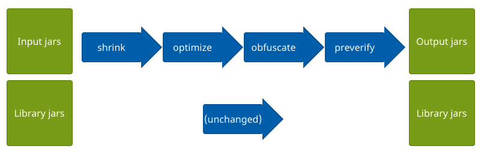

# Android ProGuard

ProGuard 能对 Java 字节码文件进行压缩、优化、混淆和预验证。

* **检测并删除未使用的类，字段，方法和属性。**

* **优化字节码并删除未使用的指令。**

* **使用简短的无意义名称重命名其余的类，字段和方法。**

* 将预验证信息添加到类中，这对于Java Micro Edition和Java 6及更高版本是必需的。

产生的应用程序和库更小，更快，并且对逆向工程的硬化更好。 ProGuard在Android开发中非常流行，但通常也可用于Java代码。

## How it works

ProGuard首先读取输入的jar（或aar，wars，ears，zip，apk或目录）。 然后，它会对其进行压缩、优化、混淆和预验证。 您可以选择让ProGuard执行多次优化过程。 ProGuard将处理后的结果写入一个或多个输出jar（或aar，wars，ears，zips，apk或目录）。 输入中可能包含资源文件，可以选择更新其名称和内容以反映混淆的类名。

ProGuard要求指定输入jar的library jars（或aars，wars，ears，zips，apk或目录）。这些本质上是编译代码所需的库。 ProGuard使用它们来重构正确处理所必需的类依赖关系。library jars本身始终保持不变。 您仍然应该将它们放在最终应用程序的类路径中。

## Entry points

为了确定必须保留的代码以及可以丢弃或混淆的代码，您必须为代码指定一个或多个入口点。这些入口点通常是具有main methods, applets, midlets, activities, etc。

* 在**压缩步骤**中，ProGuard从这些种子开始，然后递归确定所使用的类和类成员。 所有其他类和类成员将被丢弃。

* 在**优化步骤**中，ProGuard进一步优化了代码。除其他优化外，可以将非入口点的类和方法设为私有，静态或 final，可以删除未使用的参数，某些方法可能会被内联。

* 在**混淆步骤**中，ProGuard重命名不是入口点的类和类成员。 在整个过程中，保留入口点可确保仍可以使用其原始名称来访问它们。

* **预验证步骤**是不必知道入口点的唯一步骤。

## 反射 Reflection

反射（Reflection） and 自检（introspection）对于任何自动处理代码都存在特定的问题。在ProGuard中，**必须将代码中动态创建或调用的类或类成员（即，按名称）也指定为入口点**。例如，Class.forName()可以在运行时引用任何类。通常无法计算必须保留哪些类（其原始名称），因为例如可以从配置文件中读取这些类名称。因此，您必须在ProGuard配置中使用 **-keep 选项**指定它们。

但是，ProGuard已经为您检测并处理以下情况：

* Class.forName("SomeClass")
* SomeClass.class
* SomeClass.class.getField("someField")
* SomeClass.class.getDeclaredField("someField")
* SomeClass.class.getMethod("someMethod", null)
* SomeClass.class.getMethod("someMethod", new Class[] { A.class,... })
* SomeClass.class.getDeclaredMethod("someMethod", null)
* SomeClass.class.getDeclaredMethod("someMethod", new Class[] { A.class,... })
* AtomicIntegerFieldUpdater.newUpdater(SomeClass.class, "someField")
* AtomicLongFieldUpdater.newUpdater(SomeClass.class, "someField")
* AtomicReferenceFieldUpdater.newUpdater(SomeClass.class, SomeType.class, "someField")

类和类成员的名称当然可以不同，但实际上ProGuard可以识别它们的构造是相同的。 被引用的类和类成员在压缩阶段被保留，而字符串参数在混淆阶段被适当地更新。

此外，如果需要保留某些类或类成员，ProGuard将提供一些建议。 例如，ProGuard将注意类似“(SomeClass)Class.forName(variable).newInstance()”的构造。 这些可能表明该类或接口（SomeClass）and/or 其实现可能需要保留。 然后，您可以相应地调整您的配置。

> Tip：生成经过检测的构建，以允许ProGuard在运行时查找反射案例。为您的应用程序量身定制的配置建议将输出到控制台，并且可以复制/粘贴到您的配置中。 为此，只需启用选项 **-addconfigurationdebugging**

为了获得正确的结果，您至少应该对正在处理的代码有所了解。 使代码混淆不清的代码可能需要反复试验，尤其是在没有关于代码内部的必要信息的情况下。

## 参考文献

[https://www.guardsquare.com/manual/home](https://www.guardsquare.com/manual/home)

[https://github.com/Guardsquare/proguard](https://github.com/Guardsquare/proguard)
