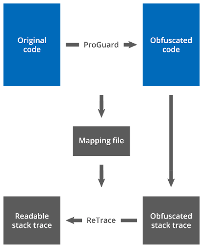

# Tools - ReTrace

* [ReTrace](#ReTrace)
* [Usage](#Usage)
* [Examples](#Examples)
  * [Restoring a stack trace with line numbers](#withlinenumbers)
  * [Restoring a stack trace with line numbers (verbose)](#withlinenumbersverbose)
  * [Restoring a stack trace without line numbers](#withoutlinenumbers)

## <a name="ReTrace">ReTrace<a/>

ReTrace是ProGuard和DexGuard的配套工具，可以“消除混淆”堆栈跟踪。

当混淆的程序引发异常时，生成的堆栈跟踪通常不是非常有用。 **类名和方法名已由无意义的短字符串替换。 源文件名和行号完全丢失**。 尽管这可能是有意的，但在调试问题时也可能很不方便。



ReTrace可以读取经过混淆的堆栈跟踪，并将其恢复为没有混淆的样子。 恢复基于混淆器（例如ProGuard，DexGuard或R8）在混淆时写出的映射文件。 映射文件将原始类名和类成员名链接到它们的混淆名。

## <a name="Usage">Usage<a/>

您可以在ProGuard发行版的lib目录中找到ReTrace jar。 要运行ReTrace，只需键入：

> java -jar retrace.jar [options...] mapping_file [stacktrace_file]

另外，bin目录包含一些简短的Linux和Windows脚本，其中包含此命令。 这些是参数：

* **mapping_file** 指定映射文件的名称。
* **stacktrace_file** （可选）指定包含堆栈跟踪的文件的名称。 如果未指定文件，则从标准输入中读取堆栈跟踪。 堆栈跟踪必须使用UTF-8编码进行编码。 空行和无法识别的行将被忽略。

支持以下options：
* `-verbose` 指定打印出更多信息堆栈跟踪，这些跟踪不仅包括方法名称，还包括方法返回类型和参数。
* `-regex regular_expression` 指定用于解析堆栈跟踪中的行的正则表达式。 指定不同的正则表达式可以消除混淆的输入类型，而不仅仅是堆栈跟踪。 这样的相对简单的表达式适用于基本的堆栈跟踪格式： `(?:.*? at %c\.%m\(%s(?::%l)?\))|(?:(?:.*?[:"] +)?%c(?::.*)?)`例如，它与以下几行匹配：`Exception in thread "main" myapplication.MyException: Some message
    at com.example.MyClass.myMethod(MyClass.java:123)`

正则表达式是Java正则表达式（请参阅`java.util.regex.Pattern`的文档），带有一些其他通配符：

WILDCARD	|DESCRIPTION	|EXAMPLE
---|---|---
%c	|matches a class name	|com.example.MyClass
%C	|matches a class name with slashes	|com/example/MyClass
%t	|matches a field type or method return type	|com.example.MyClass[]
%f	|matches a field name	|myField
%m	|matches a method name	|myMethod
%a	|matches a list of method arguments	|boolean,int
%s	|matches a source file name	|MyClass.java
%l	|matches a line number inside a method	|123

如有可能，将对与这些通配符匹配的元素进行混淆处理。 请注意，正则表达式不得包含任何捕获组。 改用非捕获组：`（?:...）`

您可以通过运行不带参数的ReTrace来打印默认的正则表达式。 它还匹配更复杂的堆栈跟踪。

恢复的堆栈跟踪将打印到标准输出。**恢复的堆栈跟踪的完整性取决于混淆的类文件中行号表的存在**：

* 如果在混淆应用程序时保留了所有行号，则ReTrace将能够完全还原堆栈跟踪。
* 如果行号已删除，则将混淆的方法名称映射回其原始名称将变得模棱两可。 `Retrace将列出堆栈跟踪中每一行的所有可能的原始方法名称`。 然后，用户可以尝试根据程序的逻辑手动推导实际的堆栈跟踪。

当前基于最外部类的名称还原源文件名。 如果您希望保留混淆的名称，则可以将默认正则表达式中的 `％s` 替换为 `.*`。

未混淆的元素和无法使用其映射的被混淆的元素将保持不变。

## <a name="Examples">Examples<a/>

### <a name="withlinenumbers">Restoring a stack trace with line numbers<a/>

假设使用以下额外选项来混淆应用程序：

```
-printmapping mapping.txt

-renamesourcefileattribute MyApplication
-keepattributes SourceFile,LineNumberTable
```

现在假定已处理的应用程序将引发异常：

```
java.io.IOException: Can't read [dummy.jar] (No such file or directory)
    at proguard.y.a(MyApplication:188)
    at proguard.y.a(MyApplication:158)
    at proguard.y.a(MyApplication:136)
    at proguard.y.a(MyApplication:66)
    at proguard.ProGuard.c(MyApplication:218)
    at proguard.ProGuard.a(MyApplication:82)
    at proguard.ProGuard.main(MyApplication:538)
Caused by: java.io.IOException: No such file or directory
    at proguard.d.q.a(MyApplication:50)
    at proguard.y.a(MyApplication:184)
    ... 6 more
```

如果已将堆栈跟踪保存在文件stacktrace.txt中，则可以使用以下命令恢复堆栈跟踪：

> retrace mapping.txt stacktrace.txt

输出将与原始堆栈跟踪相对应：

```
java.io.IOException: Can't read [dummy.jar] (No such file or directory)
    at proguard.InputReader.readInput(InputReader.java:188)
    at proguard.InputReader.readInput(InputReader.java:158)
    at proguard.InputReader.readInput(InputReader.java:136)
    at proguard.InputReader.execute(InputReader.java:66)
    at proguard.ProGuard.readInput(ProGuard.java:218)
    at proguard.ProGuard.execute(ProGuard.java:82)
    at proguard.ProGuard.main(ProGuard.java:538)
Caused by: java.io.IOException: No such file or directory
    at proguard.io.DirectoryPump.pumpDataEntries(DirectoryPump.java:50)
    at proguard.InputReader.readInput(InputReader.java:184)
    ... 6 more
```

### <a name="withlinenumbersverbose">Restoring a stack trace with line numbers (verbose)<a/>

在前面的示例中，我们还可以使用详细标志：

> java -jar retrace.jar -verbose mapping.txt stacktrace.txt

输出将如下所示：

```
java.io.IOException: Can't read [dummy.jar] (No such file or directory)
    at proguard.InputReader.void readInput(java.lang.String,proguard.ClassPathEntry,proguard.io.DataEntryReader)(InputReader.java:188)
    at proguard.InputReader.void readInput(java.lang.String,proguard.ClassPath,int,int,proguard.io.DataEntryReader)(InputReader.java:158)
    at proguard.InputReader.void readInput(java.lang.String,proguard.ClassPath,proguard.io.DataEntryReader)(InputReader.java:136)
    at proguard.InputReader.void execute(proguard.classfile.ClassPool,proguard.classfile.ClassPool)(InputReader.java:66)
    at proguard.ProGuard.void readInput()(ProGuard.java:218)
    at proguard.ProGuard.void execute()(ProGuard.java:82)
    at proguard.ProGuard.void main(java.lang.String[])(ProGuard.java:538)
Caused by: java.io.IOException: No such file or directory
    at proguard.io.DirectoryPump.void pumpDataEntries(proguard.io.DataEntryReader)(DirectoryPump.java:50)
    at proguard.InputReader.void readInput(java.lang.String,proguard.ClassPathEntry,proguard.io.DataEntryReader)(InputReader.java:184)
    ... 6 more
```

### <a name="withoutlinenumbers">Restoring a stack trace without line numbers<a/>

例如，假设应用程序已使用以下额外选项进行了混淆，但这次没有保留行号表：

```
-printmapping mapping.txt
```

然后，堆栈跟踪 stacktrace.txt 将缺少行号信息，而显示“`Unknown source`”：

```
java.io.IOException: Can't read [dummy.jar] (No such file or directory)
    at proguard.y.a(Unknown Source)
    at proguard.y.a(Unknown Source)
    at proguard.y.a(Unknown Source)
    at proguard.y.a(Unknown Source)
    at proguard.ProGuard.c(Unknown Source)
    at proguard.ProGuard.a(Unknown Source)
    at proguard.ProGuard.main(Unknown Source)
Caused by: java.io.IOException: No such file or directory
    at proguard.d.q.a(Unknown Source)
    ... 7 more
```

我们仍然可以使用相同的命令来恢复堆栈跟踪：

> java -jar retrace.jar mapping.txt stacktrace.txt

现在，输出将列出每个模棱两可的方法名称的所有替代原始方法名称：

```
java.io.IOException: Can't read [dummy.jar] (No such file or directory)
    at proguard.InputReader.execute(InputReader.java)
                            readInput(InputReader.java)
    at proguard.InputReader.execute(InputReader.java)
                            readInput(InputReader.java)
    at proguard.InputReader.execute(InputReader.java)
                            readInput(InputReader.java)
    at proguard.InputReader.execute(InputReader.java)
                            readInput(InputReader.java)
    at proguard.ProGuard.readInput(ProGuard.java)
    at proguard.ProGuard.execute(ProGuard.java)
                         optimize(ProGuard.java)
                         createPrintStream(ProGuard.java)
                         closePrintStream(ProGuard.java)
                         fileName(ProGuard.java)
    at proguard.ProGuard.main(ProGuard.java)
Caused by: java.io.IOException: No such file or directory
    at proguard.io.DirectoryPump.pumpDataEntries(DirectoryPump.java)
                                 readFiles(DirectoryPump.java)
```

例如，ReTrace无法确定方法a是对应于execute还是readInput，因此它都列出了两者。 您需要根据对应用程序的了解来解决问题。 `清晰地显示行号和明确的名称要容易得多，因此在混淆应用程序时应考虑保留行号`。
