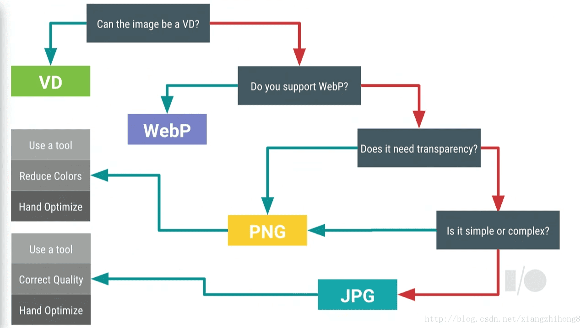
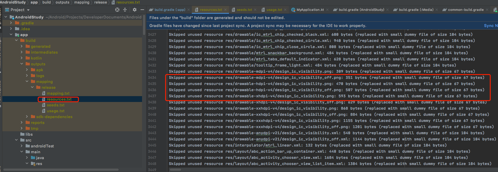

# 缩减apk大小

apk大小直接影响用户下载，用户留存，下载流量，安装占用手机内存。

优化方向：

1. **代码部分**：冗余代码、无用功能、代码混淆、方法数缩减等；
2. **资源部分**：冗余资源、资源混淆、图片处理等；
3. 对**So文件**的处理等。

* [分析工具 - Apk Analyzer](#ApkAnalyzer)
* [代码的优化](#代码的优化)
  * [移除无用代码、功能](#移除无用代码功能)
  * [移除无用的库、避免功能雷同的库](#移除无用的库避免功能雷同的库)
  * [android压缩代码和资源](#android压缩代码和资源)
  * [缩减方法数](#缩减方法数)
* [资源的优化](#资源的优化)
  * [图片资源压缩](#图片资源压缩)
  * [resources.arsc 的优化](#resourcesarsc的优化)
    * [语言压缩](#语言压缩)
    * [开启资源压缩](#开启资源压缩)
    * [重复资源优化](#重复资源优化)
    * [资源混淆](#资源混淆)
* [参考文献](#参考文献)

## <a name="ApkAnalyzer">[分析工具 - Apk Analyzer](../tools/apkAnalyzer.md)<a/>

apk构成可以通过studio自带的工具分析，占用最大的文件，提供优化方向。可以从对应章节查看相应内容。

## <a name="代码的优化">代码的优化<a/>

如何优化classes.dex的大小呢？大约有以下几种套路：

1. 保持良好的编程习惯和对包体积敏锐的嗅觉，去除重复或者不用的代码，**慎用第三方库，选用体积小的第三方SDK**。
2. 开启 `ProGuard`，通过使用 `ProGuard` 来对代码进行混淆、优化、压缩等工作

> 第一个方案对程序猿的素质要求比较高，项目经验也很重要，所以因人而异。

### <a name="移除无用代码功能">移除无用代码、功能<a/>

随着版本的迭代，部分功能可能已被去掉，但是其代码还存在项目中。**移除无用代码以及无用功能，有助于减少代码量，直接体现就是Dex的体积会变小。**

> 备注：根据经验，不用的代码在项目中存在属于一个普遍现象，相当于僵尸代码，而且这类代码过多也会导致Dex文件过大。

### <a name="移除无用的库避免功能雷同的库">移除无用的库、避免功能雷同的库<a/>

1. **项目中基础功能的库要统一实现**，避免出现多套网络请求、图片加载器等实现。
2. **不用的库要及时移除出项目**，例如我们之前确定要由某推送切换到某推送的时候，此时就要把最初项目中的推送库去掉，而不应该只是注释掉其注册代码。
3. **一些功能可以曲线救国的话就不要引入SDK**，例如定位功能，可以不引入定位SDK，而通过拿到经纬度然后调用相关接口来实现；同样实现了功能而没有引入SDK。
4. 而**引入SDK也需要考虑其方法数**,可以使用 `ClassyShark`、`Nimbledroid` 或者 `APK method count` 等工具查看。

> 备注：根据经验，项目中存在之前使用之后不使用的库的情况并不罕见。

### <a name="android压缩代码和资源">android压缩代码和资源<a/>

要尽可能减小 APK 文件，您应该启用压缩来移除发布构建中未使用的代码和资源。

代码压缩通过 [ProGuard](./proGuard.md) 提供，`ProGuard` 会检测和移除封装应用中未使用的类、字段、方法和属性，包括自带代码库中的未使用项（这使其成为以变通方式解决 64k 引用限制的有用工具）。`ProGuard` 还可优化字节码，移除未使用的代码指令，以及用短名称混淆其余的类、字段和方法。混淆过的代码可令您的 `APK` 难以被逆向工程，这在应用使用许可验证等安全敏感性功能时特别有用。

[缩减、混淆处理和优化应用](./shrinkCode.md) 将指导怎么通过配置缩减代码及资源。

### <a name="缩减方法数">缩减方法数<a/>

一般情况下缩减方法数，都是为了Android著名的64k方法数问题，此处不再回顾。而这里说缩减方法数的目的，是为了App瘦身。

通过`《Dalvik Executable format》`，我们可以看到Dex文件的组成。而从 `header-item` 表中的 `method-ids-size` 字段可以看出，方法数缩减之后，可以减少方法列表的大小；同时，方法在Dex文件中的占用空间也减少了，App自然被瘦身。

而缩减方法数，除了上面写到的普遍方法：移除无用方法、库、使用较小的SDK之外还有：

1. **避免在内部类中访问外部类的私有方法、变量**。当在Java内部类（包含匿名内部类）中访问外部类的私有方法、变量的时候，编译器会生成额外的方法，会增加方法数；
2. 避免调用派生类中的未被覆写的方法，避免在派生类中调用未覆写的基类的方法；避免用派生类的对象调用派生类中未覆盖的基类的方法。调用派生类中的未被覆盖的方法时，会多产生一个方法数；
3. **去掉部分类的get、set方法**；当然这样会牺牲一些面向对象的观念。

## <a name="资源的优化">资源的优化<a/>

对于资源的优化也是最行之有效，最为直观的优化方案。通过对资源文件的优化，可以大大的减小apk体积大小。

### <a name="图片资源压缩">图片资源压缩<a/>

图片资源是apk中占比比较大的，大量的使用大图会导致apk体积很大，所以图片的优化对apk压缩往往能起到立竿见影的效果。

为了支持Android设备DPI的多样化（`[l|m|tv|h|x|xx|xxx]dpi`）以及用户对高质量UI的期待，往往在App中使用了大量的图片以及不同的格式，例如：`PNG`、`JPG` 、`WebP`，那我们该怎么选择不同类型的图片格式呢？  

Google I/O 2016大会上推荐使用WebP格式图片，可以大大减少体积，而显示又不失真。



通过上图我们可以看出图片格式选择的方法：如果能用 `VectorDrawable` 来表示的话优先使用 `VectorDrawable`，如果支持 `WebP` 则优先用 `WebP`，而 `PNG` 主要用在展示透明或者简单的图片，而其它场景可以使用 `JPG` 格式。这样就达到了什么场景选什么图片更好。

1. 不影响显示效果的前提下，降低图片质量

2. 或者通过一些专业工具优化压缩图片，比如 [tinypng](https://github.com/lkl22/CommonTools/blob/master/util/TinifyUtil.py)

3. `svg` 转化 `xml` 图片，矢量图，google 推广 `material design`以来，很多icon都已经提供，可以直接下载使用，转换成`xml`之后，可以使 `apksize` 的大小明显降低（实践证明这个用在支持较低版本的sdk的时候会有问题，需要特殊处理）,主要针对 `200dp * 200dp` 以内的位图，超过了会影响 cpu 效率。

> 使用矢量图片能够有效的减少App中图片所占用的大小，矢量图形在Android中表示为VectorDrawable对象。 使用VectorDrawable对象，100字节的文件可以生成屏幕大小的清晰图像，但系统渲染每个VectorDrawable对象需要大量的时间，较大的图像需要更长的时间才能出现在屏幕上。 **因此只有在显示小图像时才考虑使用矢量图形**。

4. 按钮避免使用`selector`，5.0以后的版本使用`tintcolor`可以避免为一个button提供两张图片

5. [webP](https://developers.google.cn/speed/webp/?hl=zh_cn) 来替换传统的 `png`、`jpg` 格式的图片

`WebP` WebP 是 Google 的一种可以同时提供有损压缩（像 JPEG 一样）和透明度（像 PNG 一样）的图片文件格式，不过与 JPEG 或 PNG 相比，这种格式可以提供更好的压缩。`Android 4.0（API 级别 14）`及更高版本支持有损 WebP 图片，`Android 4.3（API 级别 18）`及更高版本支持无损且透明的 `WebP` 图片。这种格式为网络图像提供了卓越的无损和有损压缩。 使用 `WebP`，开发人员可以创建更小，更丰富的图像。 `WebP` 无损图像文件平均比 `PNG` 小 26% 。 这些图像文件还支持透明度（也称为 `alpha` 通道），成本只有 22% 的字节。

`WebP` 有损图像比同等 SSIM 质量指数下的 `JPG` 图像小 25-34% 。 对于可接受有损 RGB 压缩的场景，有损 `WebP` 还能支持透明度，产生的文件大小通常比 PNG 小 3 倍。

### <a name="resourcesarsc的优化">resources.arsc 的优化<a/>

关于 `resources.arsc` 的优化，主要从以下一个方面来优化：

* 对多语言进行优化
* 对被 `shrinkResources` 优化掉的资源进行处理
* 对重复的资源进行优化
* 开启资源混淆

#### 语言压缩

在 app/build.gradle 添加

```groovy
android {
    defaultConfig {
        ...
        //只保留中英文
        resConfigs "en", "zh"
    }
}
```

我们只需要将需要的语言的翻译资源打包进 apk，通过配置可以将多余的字符串资源从 apk 中移除。

#### 开启资源压缩

Android的编译工具链中提供了一款资源压缩的工具，可以通过该工具来压缩资源，如果要启用资源压缩，可以在build.gradle文件中启用，例如：

```groovy
android {
    ...
    buildTypes {
        release {
            shrinkResources true
            minifyEnabled true
            proguardFiles getDefaultProguardFile('proguard-android.txt'), 'proguard-rules.pro'
        }
    }
}
```

Android构建工具是通过 `ResourceUsageAnalyzer` 来检查哪些资源是无用的，当检查到无用的资源时会把该资源替换成预定义的小的虚拟文件。

如果想知道哪些资源是无用的，可以通过资源压缩工具的输出日志文件 `${project.buildDir}/outputs/mapping/release/resources.txt` 来查看。例如：



**资源压缩工具只是把无用资源替换为小的虚拟文件**，那我们如何删除这些无用资源呢？通常的做法是结合资源压缩工具的输出日志，找到这些资源并把它们进行删除。

如果采用人工移除的方式会带来后期的维护成本，这里采用了一种比较取巧的方式，在 Android 构建工具执行 `package${flavorName}Task` 之前通过修改 `Compiled Resources` 来实现自动去除无用资源。

使用流程如下：

1. 收集资源包（`Compiled Resources`的简称）中被替换的预定义版本的资源名称，通过查看资源包（Zip格式）中每个 `ZipEntry` 的 `CRC-32 checksum` 来寻找被替换的预定义资源，预定义资源的 `CRC-32` 定义在 `ResourceUsageAnalyzer`，下面是它们的定义。
2. 通过 [android-chunk-utils](https://github.com/madisp/android-chunk-utils) 把 `resources.arsc` 中对应的定义移除； 
3. 删除资源包中对应的资源文件。

#### 重复资源优化

产生重复资源的原因是不同的人，在开发的时候没有注意资源的可重用，对于人数比较少，规范到位是可以避免的，但是对于业务比较多，就会造成资源的重复。那么，针对这种问题，我们该怎么优化呢？ 

具体步骤如下：

1. 通过资源包中的每个ZipEntry的CRC-32 checksum来筛选出重复的资源；
2. 通过 [android-chunk-utils](https://github.com/madisp/android-chunk-utils) 修改 `resources.arsc`，把这些重复的资源都重定向到同一个文件上；
3. 把其它重复的资源文件从资源包中删除。

工具类代码片段：

```groovy
variantData.outputs.each {
    def apFile = it.packageAndroidArtifactTask.getResourceFile();

    it.packageAndroidArtifactTask.doFirst {
        def arscFile = new File(apFile.parentFile, "resources.arsc");
        JarUtil.extractZipEntry(apFile, "resources.arsc", arscFile);

        def HashMap<String, ArrayList<DuplicatedEntry>> duplicatedResources = findDuplicatedResources(apFile);

        removeZipEntry(apFile, "resources.arsc");

        if (arscFile.exists()) {
            FileInputStream arscStream = null;
            ResourceFile resourceFile = null;
            try {
                arscStream = new FileInputStream(arscFile);

                resourceFile = ResourceFile.fromInputStream(arscStream);
                List<Chunk> chunks = resourceFile.getChunks();

                HashMap<String, String> toBeReplacedResourceMap = new HashMap<String, String>(1024);

                // 处理arsc并删除重复资源
                Iterator<Map.Entry<String, ArrayList<DuplicatedEntry>>> iterator = duplicatedResources.entrySet().iterator();
                while (iterator.hasNext()) {
                    Map.Entry<String, ArrayList<DuplicatedEntry>> duplicatedEntry = iterator.next();

                    // 保留第一个资源，其他资源删除掉
                    for (def index = 1; index < duplicatedEntry.value.size(); ++index) {
                        removeZipEntry(apFile, duplicatedEntry.value.get(index).name);

                        toBeReplacedResourceMap.put(duplicatedEntry.value.get(index).name, duplicatedEntry.value.get(0).name);
                    }
                }

                for (def index = 0; index < chunks.size(); ++index) {
                    Chunk chunk = chunks.get(index);
                    if (chunk instanceof ResourceTableChunk) {
                        ResourceTableChunk resourceTableChunk = (ResourceTableChunk) chunk;
                        StringPoolChunk stringPoolChunk = resourceTableChunk.getStringPool();
                        for (def i = 0; i < stringPoolChunk.stringCount; ++i) {
                            def key = stringPoolChunk.getString(i);
                            if (toBeReplacedResourceMap.containsKey(key)) {
                                stringPoolChunk.setString(i, toBeReplacedResourceMap.get(key));
                            }
                        }
                    }
                }

            } catch (IOException ignore) {
            } catch (FileNotFoundException ignore) {
            } finally {
                if (arscStream != null) {
                    IOUtils.closeQuietly(arscStream);
                }

                arscFile.delete();
                arscFile << resourceFile.toByteArray();

                addZipEntry(apFile, arscFile);
            }
        }
    }
}
```

通过这种方式可以有效减少重复资源对包体大小的影响，同时这种操作方式对各业务团队透明。

#### 资源混淆

推荐使用微信开源的资源混淆库 [AndResGuard](https://github.com/shwenzhang/AndResGuard)，具体使用方法请查看[安装包立减1M–微信Android资源混淆打包工具](https://mp.weixin.qq.com/s?__biz=MzAwNDY1ODY2OQ==&mid=208135658&idx=1&sn=ac9bd6b4927e9e82f9fa14e396183a8f#rd)

如果使用的是bundle开发，需要换成字节跳动的 [AabResGuard](https://github.com/bytedance/AabResGuard)

## <a name="参考文献">参考文献<a/>

[适用于 Android 的 Material Design](https://developer.android.google.cn/guide/topics/ui/look-and-feel?hl=zh_cn)

[添加多密度矢量图形](https://developer.android.google.cn/studio/write/vector-asset-studio?hl=zh_cn#importing)

[创建 WebP 图片](https://developer.android.google.cn/studio/write/convert-webp?hl=zh_cn)

[Android App瘦身实战](https://cloud.tencent.com/developer/article/1038569?from=article.detail.1512087)

[Android性能优化（十）之App瘦身攻略](https://cloud.tencent.com/developer/article/1190955?from=article.detail.1512087)

[Android App包瘦身优化实践](https://blog.csdn.net/liuhuiteng/article/details/107119226)

[深入探索 Android 包瘦身（中）](https://mp.weixin.qq.com/s?__biz=Mzg2MTYzNzM5OA==&mid=2247509936&idx=1&sn=e717388dc78887f8e52250255fbb30c5&source=41#wechat_redirect)

[深入探索 Android 包瘦身（下）——终篇](https://cloud.tencent.com/developer/article/1761745?from=article.detail.1512087)

[AabResGuard: AAB 资源混淆工具](https://blog.csdn.net/ByteDanceTech/article/details/103856061)
