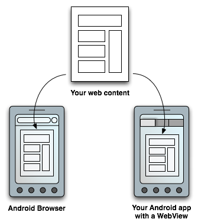

# Web-based content

Android提供了多种向用户呈现内容的方式。 为了提供与平台其他部分一致的用户体验，通常最好构建一个 native 应用程序，该应用程序应包含框架提供的体验，例如Android App Links或Search。 此外，您可以使用基于Google Play的体验，例如App Actions和Slices（可在其中使用Google Play服务）。 但是，某些应用程序可能需要增强对UI的控制。 在这种情况下，WebView是显示受信任的 first-party  的不错的选择。

图1.您可以通过两种方式向用户提供Web内容：在传统的Web浏览器和Android应用程序中，通过在布局中包含WebView。

图1说明了如何通过浏览器或自己的Android应用提供对网页的访问。 WebView框架允许您指定视口和样式属性，以使您的网页在所有主要Web浏览器的所有屏幕配置上以适当的大小显示和缩放。 您甚至可以定义Android应用程序与网页之间的接口，以允许网页中的 `JavaScript` 调用应用程序中的API，从而为基于Web的应用程序提供`Android API`。

但是，您不应仅将Android应用程序开发为查看网站的一种方式。 相反，您嵌入应用程序中的网页应该专门针对该环境而设计。

## WebView的替代品（Alternatives to WebView）

尽管WebView对象提供了对UI的增强控制，但是还有一些替代方案可以提供具有类似优点的相似功能：它们需要较少的配置，可以加载和执行得更快，可以提供改进的隐私保护，并且可以访问浏览器的cookie。

如果您的应用属于以下用例，请考虑使用这些替代WebView的方法：

* 如果要将用户发送到移动站点，请构建一个渐进式Web应用程序（PWA）。
* 如果要显示第三方Web内容，请向已安装的Web浏览器发送 intent。
* 如果要避免离开应用程序来打开浏览器，或者要自定义浏览器的UI，请使用“自定义标签”。

