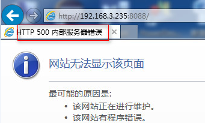

## HTTP 500 内部服务器错误



`vim /usr/local/nginx/logs/error.log` 查看nginx的错误日志

```
2018/02/08 17:37:46 [notice] 9814#0: signal process started
2018/02/09 10:57:30 [notice] 25157#0: signal process started
2018/02/09 11:11:59 [crit] 25158#0: *1 open() "/home/gerrit/gerrit_site/htpasswd.conf" failed (13: Permission denied), client: 192.168.2.249, server: gerrit.wenbin.com, request: "GET / HTTP/1.1", host: "192.168.3.235:8088"
2018/02/09 11:11:59 [crit] 25158#0: *1 open() "/home/gerrit/gerrit_site/htpasswd.conf" failed (13: Permission denied), client: 192.168.2.249, server: gerrit.wenbin.com, request: "GET / HTTP/1.1", host: "192.168.3.235:8088"
```

可以看出是没有打开文件的权限

```
chmod 755 /home/gerrit/
chmod 755 /home/gerrit/gerrit_site/htpasswd.conf
```

## Gerrit错误

> `vim /home/gerrit/gerrit\_site/logs/error\_log`查看错误日志

* ./bin/gerrit.sh: line 175: cd: /var/gerrit: No such file or directory

\*\* ERROR: Gerrit site /var/gerrit not found

> _vim /etc/default/gerritcodereview_

```
GERRIT_SITE=/home/gerrit/gerrit_site
```


