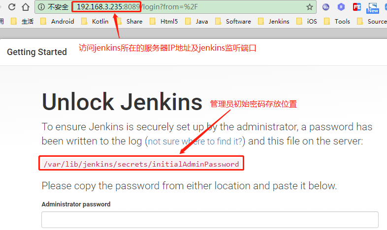
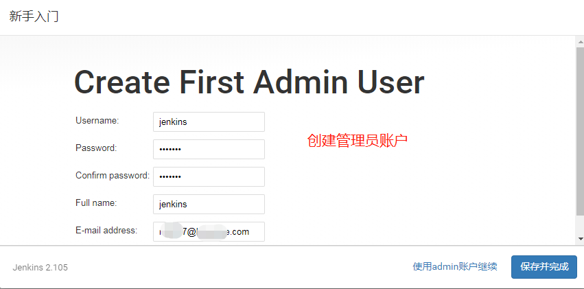

## 修改端口

> _vim /etc/sysconfig/jenkins_

```markdown
## Type:        integer(0:65535)
## Default:     8080
## ServiceRestart: jenkins
#
# Port Jenkins is listening on.
# Set to -1 to disable
#
JENKINS_PORT="8089"  //将默认8080端口改为8089
```

## 防火墙配置

> _vim /etc/firewalld/zones/public.xml_

```css
<?xml version="1.0" encoding="utf-8"?>
<zone>
  <short>Public</short>
  <description>For use in public areas. You do not trust the other computers on networks to not harm your computer. Only selected incoming connections are accepted.</description>
  <service name="dhcpv6-client"/>
  <service name="ssh"/>
  <service name="http"/>
  <port protocol="tcp" port="8089"/>
</zone>
```

配置jenkins的监听端口8089

> \[root@centos233 ~\]\# firewall-cmd --reload  
>    //重新加载
>
> success

## 首次登录



创建管理员账户jenkins



## 生成id\_rsa.pub

> `vim /etc/passwd`将false改为bash，否则无法切换到jenkins账户，ssh-keygen就无法生成密钥了

```markdown
jenkins:x:996:994:Jenkins Continuous Integration Server:/var/lib/jenkins:/bin/false -> bash
```

> ssh-keygen -t rsa -C "xxx@163.com"

> `cat ~/.ssh/id\_rsa.pub`  //添加到gerrit中jenkins用户的ssh public key列表


